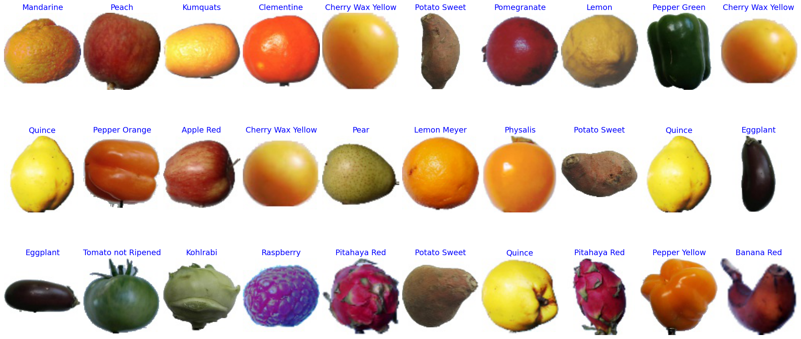
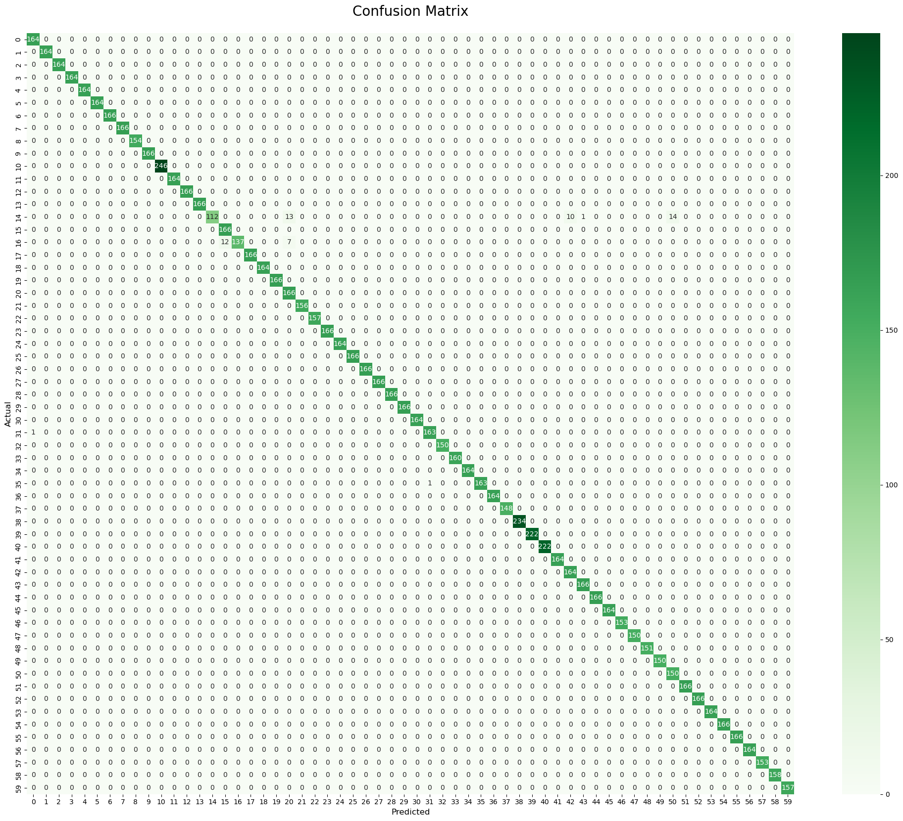
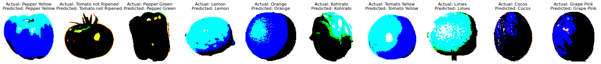

# Machine-Learning

We have conducted an academic project that involves building a fruit classification model using transfer learning with the pretrained ResNet-50 architecture. A dataset called 'fruits-360_dataset' was gathered from Kaggle,containing 90,000 fruit images across 131 categories. 60 categories were chosen for our project, with 29,440 training and 9,979 testing samples.

Images were captured in various conditions to simulate real-world scenarios. The images were then preprocessed by resizing and normalization, and data augmentation was applied to balance the data distribution for each class. ResNet-50 extracts features from input images using a series of convolutional and pooling layers. The resulting features are passed through fully connected layers for classification, with the softmax activation function used to generate the probability distribution over the possible classes. The model was trained using the Adam optimizer, and categorical cross-entropy loss function.

The trained model achieved good accuracy on the test set. The model's performance was further evaluated using a confusion matrix, precision, recall, and F1-score. The results of the classification of different fruits were examined through several visualizations and compared with the performance of other models. Overall, the developed model achieved an excellent performance, demonstrating its potential for practical applications in the fruit industry and agricultural organizations.

- Sample images from the dataset

- Confusion matrix

- Predicted output by the model

- © HB